# BrokerChain(academic)

## Several typical roles of participants

In BrokerChain’s ecosystem, anyone can become a researcher, miner, staker, market maker, or dApp developer.

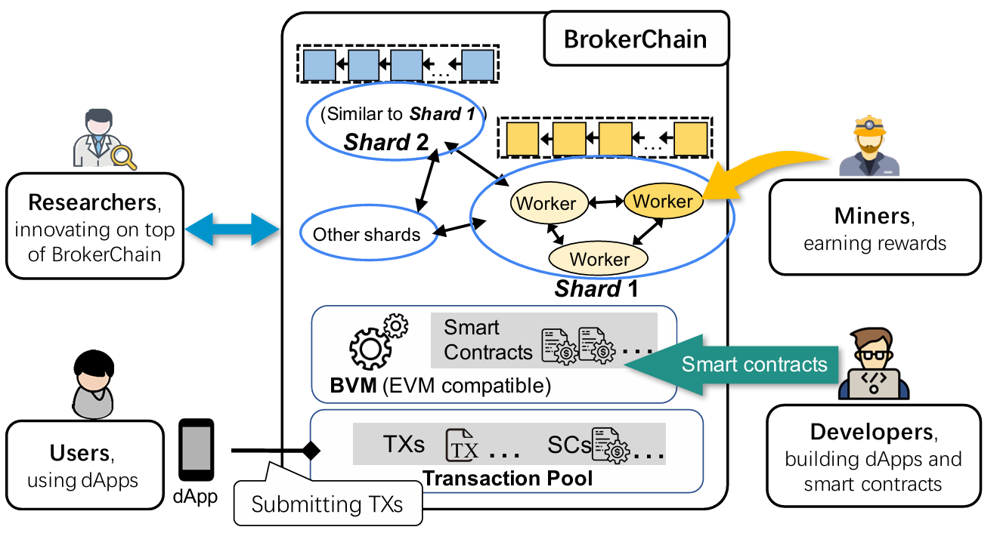

- Researchers: Researchers can use this preoject's open-source code to carry out technological innovations at the bottom of the chain.
- Miners can join the Testnet to earn mining rewards. Please visit the release page (https://github.com/HuangLab-SYSU/brokerchain-academic/releases/) to download the miner client and join the network.
- Developers can build dApps via deploying smart contracts to the embedded EVM. Please refer to the readme.md to learn how to deploy/invoke smart contracts.
- Users: refers to general users who can initiate transfer transactions, invest in BrokerChain on chain financial products, and participate in activities initiated by on chain applications using dApps. For example, when users use BrokerChain Wallet, their purposes can be subdivided into submitting transfer transactions, receiving payments, staking tokens to DeFi protocols, becoming a broker role (i.e., market maker) to earn liquidity staking income, receiving "faucet" tokens, participating in airdrops, and so on. Please visit the BrokerChain Wallet Project (https://github.com/HuangLab-SYSU/brokerwallet-academic) to download the BrokerChain Wallet APP.

## Install BrokerChain Miner Client

1. Based on your operating system, download the corresponding BrokerChain compressed package from the Release page of the BrokerChain GitHub repository (https://github.com/HuangLab-SYSU/brokerchain-academic/releases/).
2. Extract the BrokerChain compressed package into a local BrokerChain folder.

## Run BrokerChain on Windows
1. Double-click the executable file within the BrokerChain folder to run BrokerChain. While entering into the BrokerChain's welcome page, you can see the following options:
   1. Join BrokerChain as a consensus node & Open the wallet.
   2. Open the wallet page.
   3. Query an account and its balance if given an address.
   4. Transfer tokens to another account.

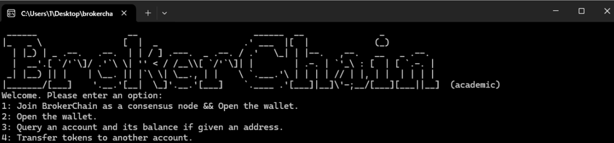

2. Enter 1 and press enter to configure the private key used by the consensus node, you can see the following options:
   1. Generate new public/private keys.
   2. Use existed private key.

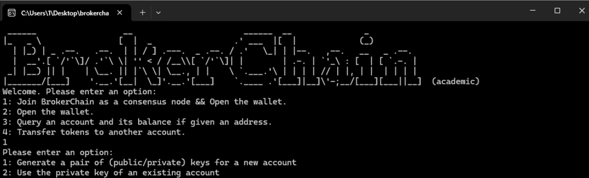

If you want to use the previously generated private key, please enter 2. Here we assume it is the first time adding Enter the BrokerChain system, enter 1, and generate a new public-private key pair.

The system prompts us to enter the storage location of the private key. If we enter 1.txt, the system will save the private key to the 1.txt file in the current BrokerChain folder.

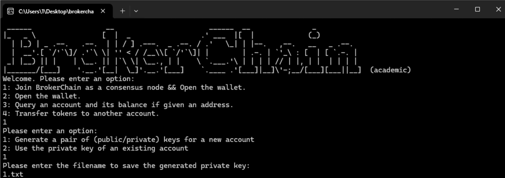

This private key is bound to your account and will only be stored locally without being sent to the network. Please keep your private key safe and do not share it with anyone, otherwise the assets in your account will be at risk. Meanwhile, if you lose your private key, you will not be able to retrieve the assets of your account.

## Run BrokerChain on MacOS

If your operating system is MacOS, please follow the instructions and steps below to launch the BrokerChain (academic) miner client program.

1. Download the release compressed file of BrokerChain (academic) executable file and extract the file to any folder. Be careful not to double-click the brokerchain.academic_macos file, otherwise the system will prompt 'unable to open'.
2. Open the "Privacy and Security" page in the system settings, find the "Security" column, and the system will prompt whether to continue opening brokerchain_academic_macos. Click "Continue Opening".
3. Open a terminal; Manually navigate to the folder path where brokerchain_academic_macos is located; Enter chmod 777 brokerchain_academic_macos in the terminal to grant permissions to the program.
4. Then enter ./brokerchain_academic_macos, You can start running the program.
5. You need to manually copy the browser address of the wallet in order to access the browser wallet page.

During the process of starting and running brokerchain_academic_macos, you may encounter some "resistance", and the reasons are explained as follows.

- Please note that you cannot double-click the brokerchain_academic_macos file to run it, as this will result in path errors causing the program to run incorrectly and exit. Need to index to the folder where the file is located in the terminal before using ./brokerchain_academic_macos command starts running it.
- Due to the deployment of IP list seed servers abroad, there may be issues such as inability to connect to the servers or network connection timeouts. At this point, you need to close the current program and try running it again multiple times until you connect to the server.
- Due to the need for a good network connection in blockchain, when prompted with network connection issues, please try adjusting the IP or DNS to default settings, or try switching between multiple different network connection methods. For example, you can switch to using other WiFi hotspots, mobile hotspots, and so on.

## Common misoperation and corresponding handling of client programs

Miners may encounter the following common "misoperations" when running consensus nodes:

- Accidentally closing the screen of the laptop running the consensus node will cause the laptop's program to enter a paused state;
- Accidentally clicked the 'Exit Program' button;
- The network is down;
- The desktop computer lost power, and even got hit by a meteorite from the sky (just a kidding);
- Always prompt for viewchange related information in program;
- The client program is stuck for unknown reasons;···

When users encounter the above situation or similar situations, they can restart the client program without worrying about losing their account balance. Therefore, we recommend users to ensure that their machine runs well and the network is unobstructed when using Miner features, and it is best to keep running the client program continuously, otherwise it will affect the benefits of participating in consensus.

## Execute consensus protocol to obtain block rewards

After passing the Proof of Work (POW), the node waits to form a new shard.

Due to the fact that a shard execution consensus protocol requires at least a certain amount of consensus nodes (e.g. 8), it is necessary to wait for some other nodes to join the system and form a new shard with your node.

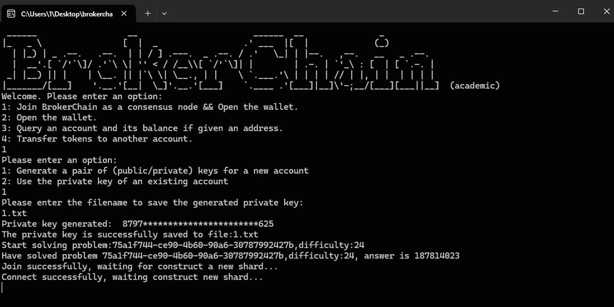

If your waiting time is too long, you can repeat the previous steps and start a new BrokerChain node with a different private key to reduce the waiting time for forming a new shard.

After forming a new shard, the system displays the browser wallet address of the current node, which you can access in your browser.

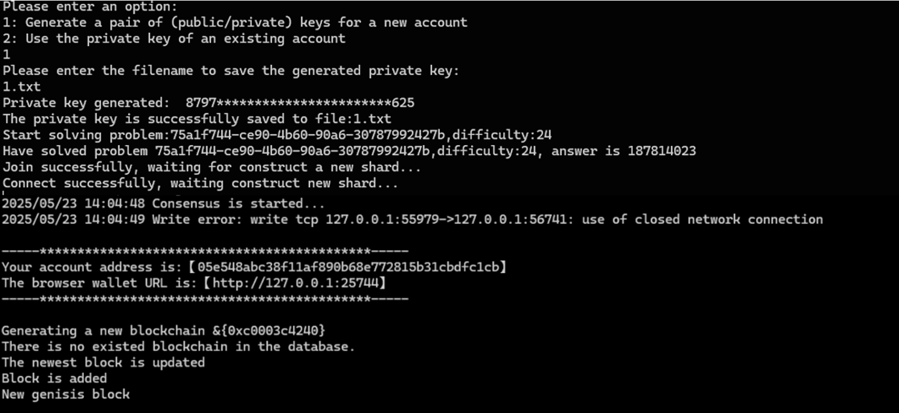

At the same time, the node will execute the consensus protocol to generate blocks, and you will receive block generation rewards.

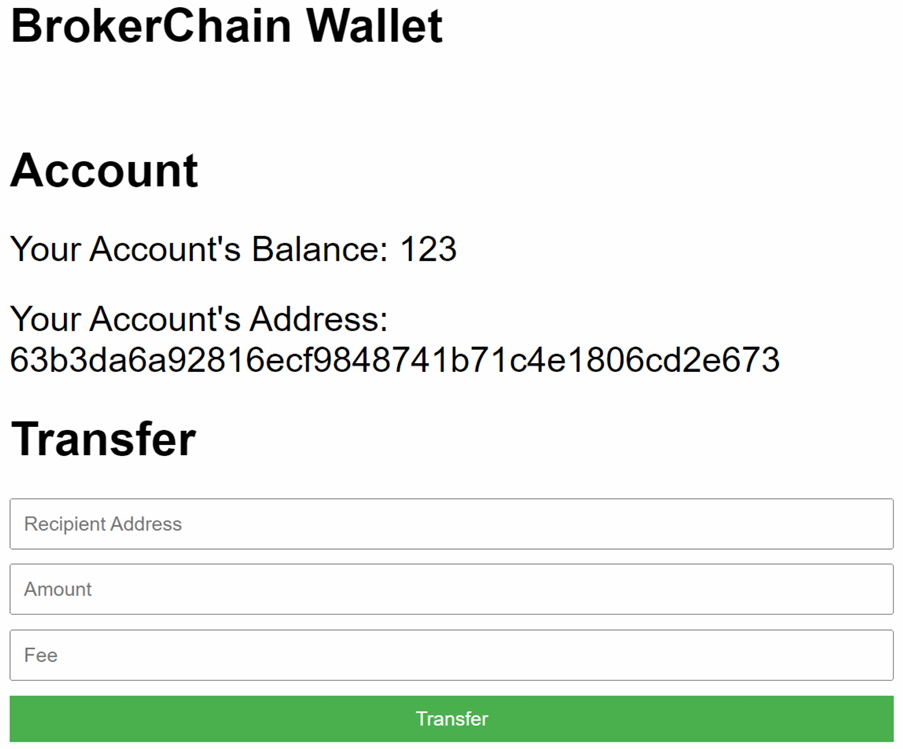

The browser wallet displays the account address and balance of the current node. As nodes execute consensus protocols to generate blocks, you will continue to receive block rewards and your account balance will continue to increase.

In addition, the browser wallet also provides a transfer function. Simply enter the receiving account address and transfer amount in the input box, and click the Transfer button to transfer the funds.

# Developer: Deploying Smart Contracts

## Visit Remix online IDE website

Remix is a mainstream online IDE that supports smart contract development. Open the browser and access the Remix website: https://remix.ethereum.org/

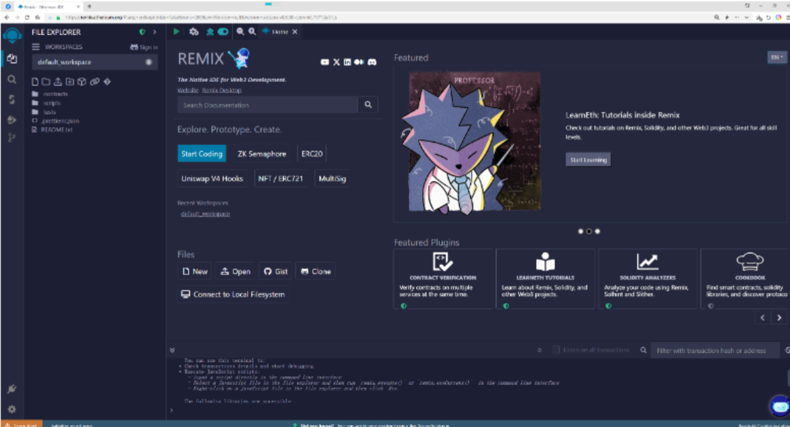

## Writing smart contracts

Click on File Explorer ->Create New File, enter A.sol, and create a new smart contract.

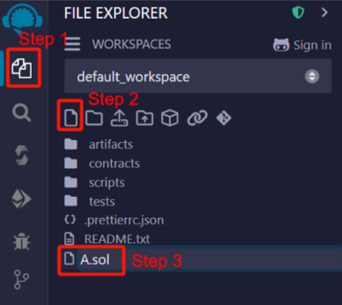

Write a simple smart contract in A.sol. This smart contract includes a constructor, a uint256 type state variable, and two functions for reading and writing this state variable.

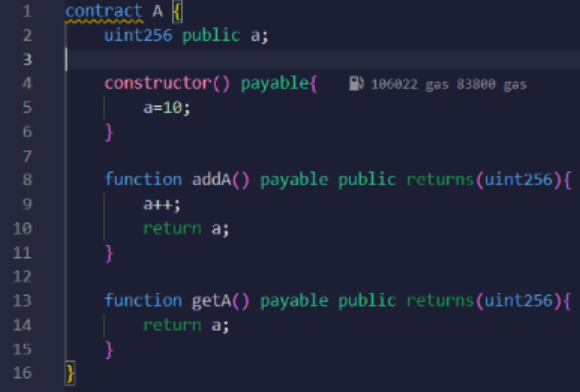

## Compile smart contracts

Click the third button on the left to jump to the contract compilation page. Select Solidity version 0.8.26 and click the Compile A.sol button to compile the smart contract.

## Connect to BrokerChain

Click on the "Deploy&run transactions" button on the left, click on the "Environment" button, and select "Custom External HTTP Provider" from the drop-down list.

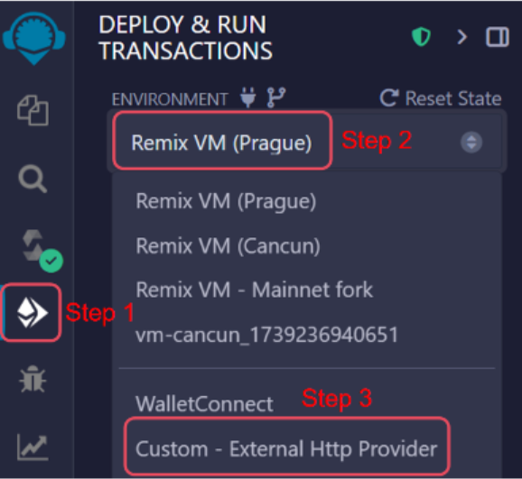

Fill in the browser wallet address obtained by launching BrokerChain in the External HTTP Provider Endpoint, and click OK.

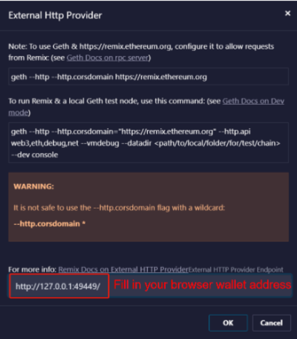

The Account box displays the address and balance of your account, which comes from block rewards and can be used for gas consumption when calling smart contracts.

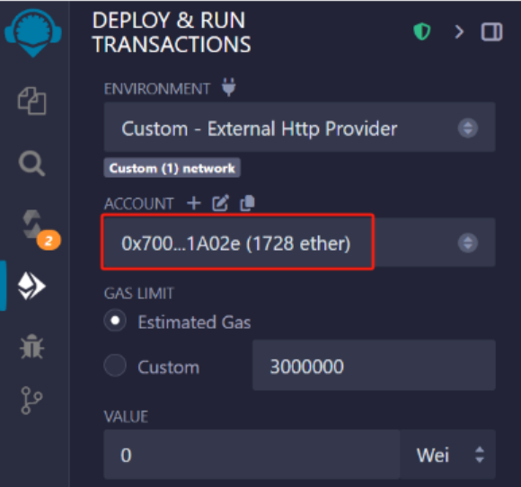

## Deploy smart contracts

Select Custom in the GAS LIMITED option and enter 600000 (if the Gas Limit is too low, deploying the contract may fail), then click the Deploy button to deploy the smart contract. After successful deployment, the address of the contract is displayed in the Deploy Contracts section below.

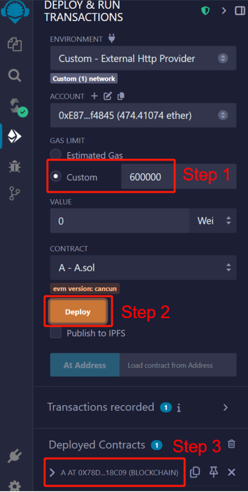

## Invoke smart contract

Click on the function of the contract in Deploy Contracts to invoke the smart contract. After a successful invoke, the console displays relevant information about the invoke, such as status, transaction hash, block hash, consumption of GAS, etc.

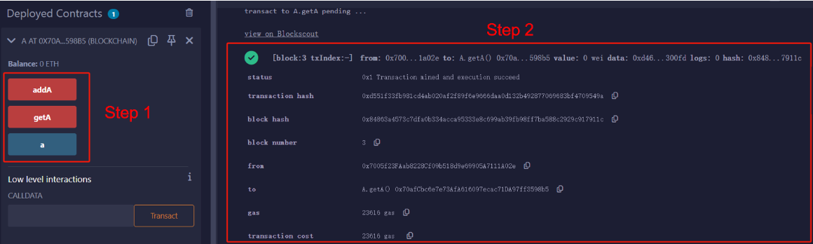

# Disclaimers

- BrokerChain (academic) is only for academic exchange purposes, and users are not allowed to engage in any illegal activities using BrokerChain (academic).
- Any direct or indirect consequences arising from the use of BrokerChain by users are not related to the founding team of BrokerChain.
- The founding team of BrokerChain (academic) reserves the right to modify, update, or terminate BrokerChain (academic) at any time without prior notice to users.
- When using BrokerChain (academic), users should bear the risks themselves and agree to waive any claims against the founding team.

This disclaimer is governed by and interpreted in accordance with the laws of the People's Republic of China.