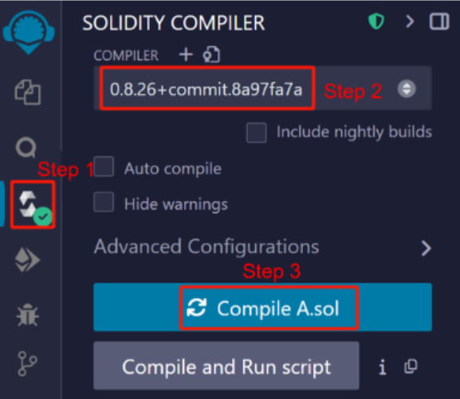

# BrokerChain (academic)

## Overview

### Several typical Roles of Participants

In BrokerChain’s ecosystem, anyone can become a researcher, miner, staker, market maker, or dApp developer.

Researchers: Researchers can use this project's open-source code to implement technological innovations at the bottom of the chain.
- Miners can join the Testnet to earn mining rewards. Please visit the release page ( https://github.com/HuangLab-SYSU/brokerchain-academic/releases/ ) to download the miner client and join the network.
- Developers can build dApps by deploying smart contracts to the embedded EVM. Please review the README.md to learn how to deploy/invoke smart contracts.
- Users: refers to general users who can initiate transfer transactions, invest in BrokerChain on-chain financial products, and participate in activities undertaken by on-chain applications using dApps. For example, when users use BrokerChain Wallet, their purposes can be subdivided into submitting transfer transactions, receiving payments, staking tokens to DeFi protocols, becoming a broker role (i.e., market maker) to earn liquidity staking income, receiving "faucet" tokens, participating in airdrops, and so on. Please visit the BrokerChain Wallet Project (https://github.com/HuangLab-SYSU/brokerwallet-academic) to download the BrokerChain Wallet APP.

### BrokerChain Token-issuing Plan
The total supply of BrokerChain tokens (a.k.a. BKC) is capped at 1.2 billion, distributed through a hybrid model combining pre-allocated reserves and a four-year halving emission schedule for public issuance. 

About 25% of the supply is reserved for community-building initiatives and incentivizing early developers, ensuring sustainable ecosystem growth. The remaining tokens enter circulation via a decaying emission mechanism to promote long-term value alignment, reducing block rewards by half every four years.

## BrokerChain Dashboard 

Users can access the **BrokerChain Dashboard** at【 http://academic.broker-chain.com:56741/ 】.

- **View Minted Token Quantities**: Check the total number of tokens that have been minted.
- **Check Account's Balance**: Query the balance of any given account address.
- **Apply for Faucet Tokens dedicated for Developers**: Through the faucet service, you can request tokens designed explicitly for developers.

 You can also access more advanced features from this Dashboard page.

## BrokerChain Wallet
Users can visit the **BrokerChain Wallet** project ( https://github.com/HuangLab-SYSU/brokerwallet-academic ) to download the BrokerChain Wallet app and run it on Android devices.

## Install BrokerChain Miner Client

1. Based on your operating system, download the corresponding BrokerChain compressed package from the Release page of the BrokerChain GitHub repository (https://github.com/HuangLab-SYSU/brokerchain-academic/releases/).
2. Extract the BrokerChain compressed package into a local BrokerChain folder.

## Run a BrokerChain Miner Client on Windows
1. Double-click the executable file within the BrokerChain folder to run BrokerChain. While entering the BrokerChain's welcome page, you can see the following options:
   1. Join BrokerChain as a consensus node & open the webpage wallet.
   2. Open the wallet page for the given account address.
   3. Query an account and its balance if given an address.
   4. Transfer tokens to another account.

2. Enter "1" and press Enter to configure the private key used by the consensus node. You can see the following options:
   1. Generate a new (public/private) key and the associated account address.
   2. Use the existing private key.

If you want to use the previously generated private key, please enter "2." Here, we assume you are adding the Enter the BrokerChain system for the first time. Enter "1" to generate a new public-private key pair.

The system prompts us to enter the storage location of the private key. If we enter _1.txt_, the system will save the private key to the 1.txt file in the current BrokerChain folder.

This private key is bound to your account and will only be stored locally without being sent to the network. Please keep your private key safe and do not share it with anyone; otherwise, your account's assets will be at risk. Meanwhile, if you lose your private key, you cannot retrieve your account's assets.

## Run a BrokerChain Miner Client on MacOS

If your operating system is macOS, you can follow the instructions and steps below to launch the BrokerChain (academic) miner client program.

1. Download the release compressed BrokerChain (academic) executable file and extract it to any folder. Be careful not to double-click the brokerchain.academic_macos file; otherwise, the system will prompt 'unable to open'.
2. Open the "Privacy and Security" page in the system settings, find the "Security" column, and click "Continue Opening." The system will prompt whether to continue opening brokerchain_academic_macos.
3. Open a terminal; Manually navigate to the folder path where brokerchain_academic_macos is located; Enter chmod 777 brokerchain_academic_macos in the terminal to grant permissions to the program.
4. Then input "./brokerchain_academic_macos". You can start running the program.
5. To access the browser wallet page, you must manually copy the wallet's browser address.

While starting and running _brokerchain_academic_macos_, you may encounter some "resistance," explained below.

- Please note that you cannot double-click the brokerchain_academic_macos file to run it, as this will result in path errors, causing the program to run incorrectly and exit. You need to index the folder where the file is located in the terminal before using the ./brokerchain_academic_macos command to start running it.
- Due to deploying IP list seed servers abroad, issues such as an inability to connect to the servers or network connection timeouts may occur. You need to close the current program and try rerunning it multiple times until you connect to the server.
- Due to the need for a good network connection in blockchain, when prompted with network connection issues, please try adjusting the IP or DNS to default settings or switching between multiple network connection methods. For example, you can use other WiFi, mobile hotspots, etc.

## Common misoperation and corresponding handling of client programs

Miners may encounter the following common "misoperations" when running consensus nodes:

- Accidentally closing the laptop screen running the consensus node will cause the laptop's program to be paused.
- Accidentally clicked the 'Exit Program' button.
- The network is down.
- The desktop computer lost power, and even got hit by a meteorite from the sky (just kidding);
- Always prompt for viewchange-related information in the program.
- The client program is stuck for unknown reasons.
- ···

When users encounter the above situation or similar situations, they can restart the client program without worrying about losing their account balance. So, we recommend that users ensure their machine runs well and the network is unobstructed when using Miner features. It is best to keep running the client program continuously; otherwise, it will affect the benefits of participating in consensus.

## Execute consensus protocol to obtain block rewards

After joining the network, your node waits to form a new shard.

Because a shard execution consensus protocol requires at least a certain number of consensus nodes (e.g., 32), you must wait for others to join the network and form a new shard with yours.

If your waiting time is too long, you can repeat the previous steps and start a new BrokerChain node with a different private key to reduce the waiting time for forming a new shard.

After forming a new shard, the system displays the browser wallet address of the current node, which you can access in your browser.

At the same time, the node will execute the consensus protocol to generate blocks, and you will receive block generation rewards.

The browser wallet displays the account address and balance of the current node. As nodes execute consensus protocols to generate blocks, you will continue to receive block rewards, increasing your account balance.

The browser wallet also provides a transfer function. To transfer funds, enter the receiving account address and transfer amount in the input box and click the Transfer button.

# Developer: Deploying Smart Contracts

## Visit Remix online IDE website

Remix is a mainstream online IDE that supports the development of smart contracts. Open the browser and access the Remix website: https://remix.ethereum.org/

## Writing smart contracts

Click on File Explorer -> Create New File, enter _A.sol_, and create a new smart contract.

Write a simple smart contract in _A.sol_. This smart contract includes a constructor, a uint256 type state variable, and two functions for reading and writing this state variable.

## Compile smart contracts

Click the third button on the left to jump to the contract compilation page. Select Solidity version 0.8.26 and click the Compile A.sol button to compile the smart contract.

## Connect to BrokerChain

Click on the "Deploy&run transactions" button on the left, click on the "Environment" button, and select "Custom External HTTP Provider" from the drop-down list.

Please enter the browser wallet address obtained by launching BrokerChain in the External HTTP Provider Endpoint and clicking OK.

The Account box displays your account address and balance. Your account comes from block rewards and can be used for gas consumption when calling smart contracts.

## Deploy smart contracts

Select Custom in the GAS LIMITED option and enter 600000 (if the Gas Limit is too low, deploying the contract may fail), then click the Deploy button to deploy the smart contract. After successful deployment, the contract's address is displayed in the Deploy Contracts section below.

## Invoke smart contract

Click on the contract's function in Deploy Contracts to invoke the smart contract. After a successful invoke, the console displays relevant information about the invoke, such as status, transaction hash, block hash, consumption of GAS, etc.

# Disclaimers

- BrokerChain (academic) is only for educational purposes, and users are not allowed to engage in any illegal activities using BrokerChain (academic).
- Any direct or indirect consequences arising from users' use of BrokerChain are unrelated to the founding team of BrokerChain.
- The founding team of BrokerChain (academic) reserves the right to modify, update, or terminate BrokerChain (academic) without prior notice to users.   
- When using BrokerChain (academic), users should bear the risks themselves and agree to waive any claims against the founding team.
- This disclaimer is governed by and interpreted by the laws of the People's Republic of China.
